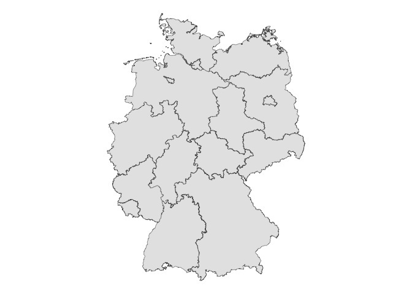
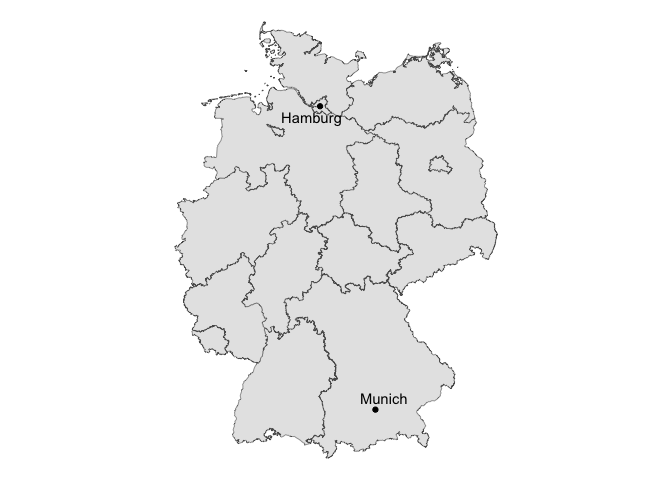

# germany_map


`fs` for file systems

``` r
library(tidyverse)
```

    ── Attaching core tidyverse packages ──────────────────────── tidyverse 2.0.0 ──
    ✔ dplyr     1.1.4     ✔ readr     2.1.5
    ✔ forcats   1.0.0     ✔ stringr   1.5.1
    ✔ ggplot2   3.5.1     ✔ tibble    3.2.1
    ✔ lubridate 1.9.3     ✔ tidyr     1.3.1
    ✔ purrr     1.0.2     
    ── Conflicts ────────────────────────────────────────── tidyverse_conflicts() ──
    ✖ dplyr::filter() masks stats::filter()
    ✖ dplyr::lag()    masks stats::lag()
    ℹ Use the conflicted package (<http://conflicted.r-lib.org/>) to force all conflicts to become errors

``` r
library(fs)
library(sf)
```

    Linking to GEOS 3.11.0, GDAL 3.5.3, PROJ 9.1.0; sf_use_s2() is TRUE

``` r
library(geodata)
```

    Loading required package: terra
    terra 1.7.78

    Attaching package: 'terra'

    The following object is masked from 'package:tidyr':

        extract

``` r
de_st <- gadm(
  country = "Germany", 
  path = path_temp(),
  resolution = 2
)
```

``` r
de_st |> 
  st_as_sf() ->
  de_sf
```

``` r
de_sf |> 
  ggplot() +
    geom_sf()+
    theme_void()
```



``` r
library(tidygeocoder)
```

``` r
tibble(
  city = c(
    "Hamburg",
    "Munich"
  ),
  location = str_glue(
    "{city}, Germany"
  )
) |> 
  geocode(location)-> 
  cities_df
```

    Passing 2 addresses to the Nominatim single address geocoder

    Query completed in: 2 seconds

``` r
cities_df
```

    # A tibble: 2 × 4
      city    location           lat  long
      <chr>   <glue>           <dbl> <dbl>
    1 Hamburg Hamburg, Germany  53.6  10.0
    2 Munich  Munich, Germany   48.1  11.6

``` r
library(ggrepel)
```

``` r
de_sf |> 
  ggplot() +
  geom_sf()+
  geom_point(
    data = cities_df, 
    aes(
      x = long,
      y = lat
    )
  )+
  geom_text_repel(
    data = cities_df, 
    aes(
      x = long,
      y = lat,
      label = city
    )
  )+
  theme_void()
```


